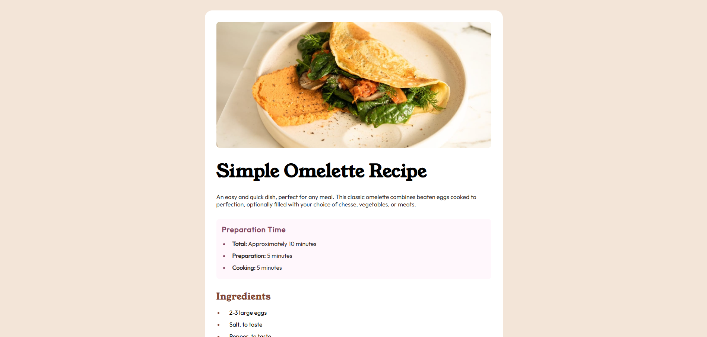

# Frontend Mentor - Recipe page solution

This is a solution to the [Recipe page challenge on Frontend Mentor](https://www.frontendmentor.io/challenges/recipe-page-KiTsR8QQKm). Frontend Mentor challenges help you improve your coding skills by building realistic projects.

## Table of contents

- [Overview](#overview)
  - [The challenge](#the-challenge)
  - [Screenshot](#screenshot)
  - [Links](#links)
- [My process](#my-process)
  - [Built with](#built-with)
  - [What I learned](#what-i-learned)
  - [Continued development](#continued-development)
  - [Useful resources](#useful-resources)
- [Author](#author)
- [Acknowledgments](#acknowledgments)

## Overview

This project is a solution to the Recipe Page challenge from Frontend Mentor. The goal of this challenge was to build a clean, responsive recipe page based on a provided design, focusing on semantic HTML structure, proper layout techniques, and visual accuracy.

The page displays a recipe with sections such as preparation time, ingredients, and instructions, styled to closely match the original design. Special attention was given to typography, spacing, color consistency, and responsive behavior across different screen sizes.

This project helped reinforce best practices in structuring content semantically, organizing CSS efficiently, and following a mobile-first workflow to ensure a smooth user experience on both mobile and desktop devices.

### Screenshot



Below is a preview of the final implementation of the Recipe Page challenge. The layout closely follows the provided design, with careful attention to typography, spacing, colors, and responsive behavior across different screen sizes.

The design adapts smoothly from mobile to desktop, maintaining visual hierarchy and readability while preserving the overall aesthetic of the original mockup.

### Links

- Solution URL: [GitHub](https://github.com/yomidev/Huevito-FirstPage)
- Live Site URL: [GitHub Pages](https://your-live-site-url.com)

## My process

### Built with

- Semantic HTML5 markup
- Custom fonts with @font-face
- CSS custom properties and structured styling
- Responsive design using media queries
- Mobile-first workflow

### What I learned

While working on this project, I reinforced the importance of semantic HTML structure to organize content clearly and meaningfully. I used elements such as

```html
<main>
  <header>
    <section>
      <ul>
        <ol>
          <table></table>
        </ol>
      </ul>
    </section>
  </header>
</main>
```

to properly structure the recipe content.

I also practiced organizing CSS in a clean and maintainable way. Instead of using layout systems like Flexbox or Grid, I focused on controlling spacing, margins, typography, and widths to achieve the desired layout. Centering the container using

```css
.container {
  margin: 0 auto;
}
```

and managing responsiveness with media queries helped me understand how traditional CSS layout techniques still play an important role.

Another key learning point was working with custom fonts using @font-face and applying consistent color schemes and spacing to closely match the original design.

### Continued development

In future projects, I would like to explore more advanced layout techniques such as Flexbox and CSS Grid to create more dynamic and scalable layouts. I also want to continue improving my responsive design skills and deepen my understanding of accessibility best practices.

Additionally, I plan to focus more on writing cleaner, more reusable CSS and optimizing visual consistency across different screen sizes.

## Author

- Website - [Yomira Martínez](https://github.com/yomidev)
- Frontend Mentor - [@yomidev](https://www.frontendmentor.io/profile/yomidev)
- Twitter - [@yomimsm](https://x.com/yomimsm)

## Acknowledgments

Thanks to Frontend Mentor for creating this challenge and providing an excellent opportunity to practice frontend development skills.
